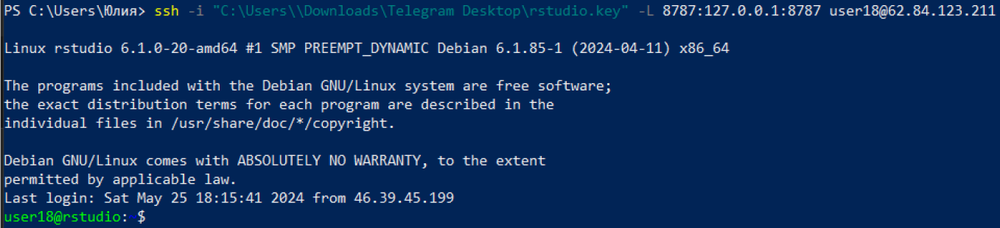
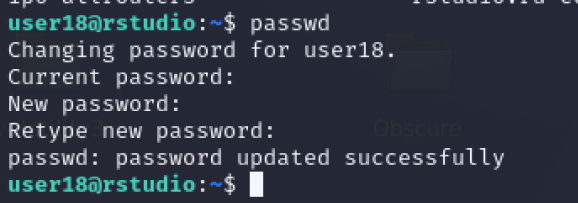
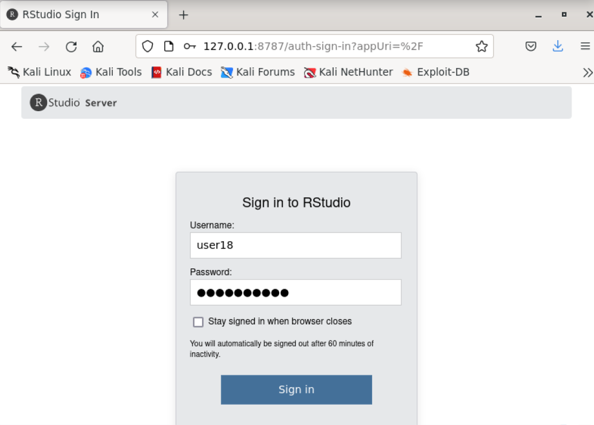

# Практическое задание №3
Журавлева Юлия БИСО-01-20

# Анализ данных сетевого трафика при помощи библиотеки Arrow

## Цель работы

1.  Изучить возможности технологии Apache Arrow для обработки и анализ
    больших данных
2.  Получить навыки применения Arrow совместно с языком программирования
    R
3.  Получить навыки анализа метаинфомации о сетевом трафике
4.  Получить навыки применения облачных технологий хранения, подготовки
    и анализа данных: Yandex Object Storage, Rstudio Server.

## Исходные данные

1.  ОС Kali Linux
2.  Apache Arrow
3.  Yandex Object Storage
4.  RStudio Server

## Задание

Используя язык программирования R, библиотеку arrow и облачную
`IDE Rstudio Server`, развернутую в `Yandex Cloud`, выполнить задания и
составить отчет.

## Ход работы

### 1. Настройка подключения к IDE Rstudio Server через ssh-туннель

-   Подключимся к удалённому серверу через ssh-туннель как пользователь
    user18.

<!-- -->

    ssh -i /home/kali/Downloads/rstudio.key -L 8787:127.0.0.1:8787 user18@62.84.123.211

В случае, если команда выдаёт ошибку в доступе по .key, связанную с
правами пользователя, то перед повторным подключением поменяем права
командой.

    chmod =600 /home/kali/Downloads/rstudio.key



-   Поменяем пароль с дефолтного на персональный.



-   Перейдём по адресу `http://127.0.0.1:8787` и зайдём под созданным
    пользователем `user18`.



### 2. Настройка rabochego prprpr

``` r
library(arrow)
```

    Some features are not enabled in this build of Arrow. Run `arrow_info()` for more information.


    Attaching package: 'arrow'

    The following object is masked from 'package:utils':

        timestamp

``` r
library(tidyverse)
```

    ── Attaching core tidyverse packages ──────────────────────── tidyverse 2.0.0 ──
    ✔ dplyr     1.1.4     ✔ readr     2.1.5
    ✔ forcats   1.0.0     ✔ stringr   1.5.1
    ✔ ggplot2   3.4.4     ✔ tibble    3.2.1
    ✔ lubridate 1.9.3     ✔ tidyr     1.3.1
    ✔ purrr     1.0.2     
    ── Conflicts ────────────────────────────────────────── tidyverse_conflicts() ──
    ✖ lubridate::duration() masks arrow::duration()
    ✖ dplyr::filter()       masks stats::filter()
    ✖ dplyr::lag()          masks stats::lag()
    ℹ Use the conflicted package (<http://conflicted.r-lib.org/>) to force all conflicts to become errors

dfdfdf

## Обработка данных

Задание 1: Найдите утечку данных из Вашей сети Задание 2: Найдите утечку
данных 2 Задание 3: Найдите утечку данных 3

## Вывод

текст
