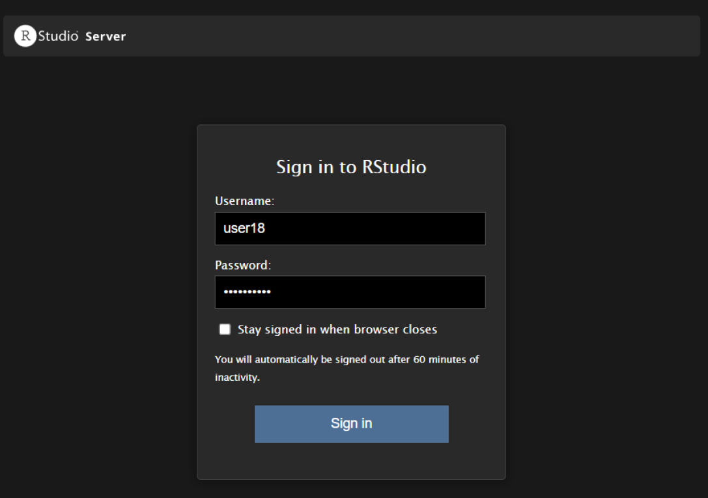

# Практическое задание №3
Журавлева Юлия БИСО-01-20

# Анализ данных сетевого трафика при помощи библиотеки Arrow

## Цель работы

1.  Изучить возможности технологии Apache Arrow для обработки и анализ
    больших данных
2.  Получить навыки применения Arrow совместно с языком программирования
    R
3.  Получить навыки анализа метаинфомации о сетевом трафике
4.  Получить навыки применения облачных технологий хранения, подготовки
    и анализа данных: Yandex Object Storage, Rstudio Server.

## Исходные данные

1.  Ноутбук с ОС Windows 10
2.  Apache Arrow
3.  Yandex Object Storage
4.  RStudio Server

## Задание

Используя язык программирования R, библиотеку arrow и облачную
`IDE Rstudio Server`, развернутую в `Yandex Cloud`, выполнить задания и
составить отчет.

## Ход работы

### 1. Настройка подключения к IDE Rstudio Server через ssh-туннель

-   Подключимся к удалённому серверу через ssh-туннель как пользователь
    user18.

<!-- -->

    PS C:\Users\Юлия> ssh -i "C:\Users\\Downloads\Telegram Desktop\rstudio.key" -L 8787:127.0.0.1:8787 user18@62.84.123.211


-   Поменяем пароль с дефолтного на персональный. Скриншот предоставлен
    с системы Kali Linux, так как первоначальная настройка была именно
    на нём, но из-за возникших проблем на ВМ, пришлось перейти на
    основную систему Windows.


-   Перейдём по адресу `http://127.0.0.1:8787` и зайдём под созданным
    пользователем `user18`.



-   Настроим Git на RStudio Server с помощью SSH ключа. Так как
    изначально установка была на ОС Kali Linux, то повторной
    аутентификации на ОС Windows не потребовалось.


Однако этого оказалось недостаточно для пуша в репозиторий, поэтому
после танцев с бубном, спасение нашлось в индивидуальном токене
пользователя на замену аутентификации по паролю.


### 2. Настройка рабочего пространства

-   Первым делом установим необходимые библиотеки

``` r
library(arrow)
```

    Warning: пакет 'arrow' был собран под R версии 4.2.3


    Присоединяю пакет: 'arrow'

    Следующий объект скрыт от 'package:utils':

        timestamp

``` r
library(tidyverse)
```

    Warning: пакет 'tidyverse' был собран под R версии 4.2.3

    Warning: пакет 'ggplot2' был собран под R версии 4.2.3

    Warning: пакет 'tibble' был собран под R версии 4.2.3

    Warning: пакет 'tidyr' был собран под R версии 4.2.3

    Warning: пакет 'readr' был собран под R версии 4.2.3

    Warning: пакет 'purrr' был собран под R версии 4.2.3

    Warning: пакет 'dplyr' был собран под R версии 4.2.3

    Warning: пакет 'stringr' был собран под R версии 4.2.3

    Warning: пакет 'forcats' был собран под R версии 4.2.3

    Warning: пакет 'lubridate' был собран под R версии 4.2.3

    ── Attaching core tidyverse packages ──────────────────────── tidyverse 2.0.0 ──
    ✔ dplyr     1.1.4     ✔ readr     2.1.4
    ✔ forcats   1.0.0     ✔ stringr   1.5.0
    ✔ ggplot2   3.4.4     ✔ tibble    3.2.1
    ✔ lubridate 1.9.3     ✔ tidyr     1.3.0
    ✔ purrr     1.0.2     

    ── Conflicts ────────────────────────────────────────── tidyverse_conflicts() ──
    ✖ lubridate::duration() masks arrow::duration()
    ✖ dplyr::filter()       masks stats::filter()
    ✖ dplyr::lag()          masks stats::lag()
    ℹ Use the conflicted package (<http://conflicted.r-lib.org/>) to force all conflicts to become errors

``` r
library(dplyr)
```

-   Далее создаем директорию dataset и загружаем в нее dataframe
    arrow-datasets/tm_data.pqt из Yandex Object Storage.

``` r
dir.create("dataset")
```

    Warning in dir.create("dataset"): 'dataset' уже существует

``` r
curl::multi_download("https://storage.yandexcloud.net/arrow-datasets/tm_data.pqt", "dataset/ya_dt.pqt",
  resume = TRUE
)
```

    # A tibble: 1 × 10
      success status_code resumefrom url    destfile error type  modified
      <lgl>         <int>      <dbl> <chr>  <chr>    <chr> <chr> <dttm>  
    1 TRUE            416          0 https… "C:\\Us… <NA>  appl… NA      
    # ℹ 2 more variables: time <dbl>, headers <list>

-   Посмотрим содержимое нашего датасета, чтобы убедиться, что он
    работает.

``` r
full_df <- arrow::open_dataset(sources = "dataset/ya_dt.pqt", format  = "parquet")
full_df %>% glimpse()
```

    FileSystemDataset with 1 Parquet file
    105,747,730 rows x 5 columns
    $ timestamp <double> 1.578326e+12, 1.578326e+12, 1.578326e+12, 1.578326e+12, 1.5…
    $ src       <string> "13.43.52.51", "16.79.101.100", "18.43.118.103", "15.71.108…
    $ dst       <string> "18.70.112.62", "12.48.65.39", "14.51.30.86", "14.50.119.33…
    $ port       <int32> 40, 92, 27, 57, 115, 92, 65, 123, 79, 72, 123, 123, 22, 118…
    $ bytes      <int32> 57354, 11895, 898, 7496, 20979, 8620, 46033, 1500, 979, 103…
    Call `print()` for full schema details

-   Заметим, что с полем `timestamp` что-то не так, а именно указан
    неверный тип данных. Приведём его в более понятный вид.

``` r
full_df <- full_df %>% mutate(timestamp = as_datetime(timestamp / 1000, origin = "1970-01-01", tz = "UTC"))
full_df %>% glimpse()
```

    FileSystemDataset with 1 Parquet file (query)
    105,747,730 rows x 5 columns
    $ timestamp <timestamp[ns, tz=UTC]> 2020-01-06 16:00:00, 2020-01-06 16:00:00, 20…
    $ src                      <string> "13.43.52.51", "16.79.101.100", "18.43.118.1…
    $ dst                      <string> "18.70.112.62", "12.48.65.39", "14.51.30.86"…
    $ port                      <int32> 40, 92, 27, 57, 115, 92, 65, 123, 79, 72, 12…
    $ bytes                     <int32> 57354, 11895, 898, 7496, 20979, 8620, 46033,…
    Call `print()` for query details

## Обработка данных

### Задание 1: Найдите утечку данных из Вашей сети

***Поставленная задача***

Важнейшие документы с результатами нашей исследовательской деятельности
в области создания вакцин скачиваются в виде больших заархивированных
дампов. Один из хостов в нашей сети используется для пересылки этой
информации – он пересылает гораздо больше информации на внешние ресурсы
в Интернете, чем остальные компьютеры нашей сети. Определите его
IP-адрес.

-   Для начала определим IP адреса внутренней сети, которые начинаются с
    12-14 октетов.

``` r
df_inside <- full_df %>%
  filter(str_detect(src, "^1[2-4].")) %>%
  filter(!str_detect(dst, "^1[2-4]."))
```

-   Используя отфильтрованные данные внутреннего трафика, сгрупируем по
    IP-адресу источника и просуммируем его общее количество байтов.
    Выведем на экран итоговые значения источика с наибольшим количеством
    байтов.

``` r
sus_host <- df_inside %>% group_by(src) %>% 
  summarise(ins_sum = sum(bytes)) %>% arrange(desc(ins_sum)) %>% collect()

sus_host_1 <- sus_host %>% slice(1)

cat("IP-адрес подозрительного хоста:", sus_host_1$src, "\n", 
    "Сумма затраченного трафика (байт)", format(sus_host_1$ins_sum, scientific = FALSE))
```

    IP-адрес подозрительного хоста: 13.37.84.125 
     Сумма затраченного трафика (байт) 10625497574

### Задание 2: Найдите утечку данных 2

***Поставленная задача***

Другой атакующий установил автоматическую задачу в системном
планировщике `cron` для экспорта содержимого внутренней wiki системы.
Эта система генерирует большое количество трафика в нерабочие часы,
больше чем остальные хосты. Определите IP этой системы. Известно, что ее
IP адрес отличается от нарушителя из предыдущей задачи.

-   Для начала посчитаем по известным часам сумму трафика.

``` r
hours <- full_df %>% group_by(hour(timestamp)) %>%
  summarise(ins_sum_2 = sum(bytes)) %>% arrange(desc(ins_sum_2)) %>% collect()

hours %>% head(10)
```

    # A tibble: 10 × 2
       `hour(timestamp)`    ins_sum_2
                   <int>      <int64>
     1                23 274018545181
     2                18 273957078313
     3                16 273911433028
     4                20 273906852618
     5                21 273870082226
     6                22 273865554455
     7                19 273843857318
     8                17 273636993943
     9                 7  10566144869
    10                 8  10471822189

-   Заметим, что самое большое количество трафика затрачивается с 16 до
    23, что может указать нам на работу автоматической задачи. Известно,
    что искомый IP адрес отличается от нарушителей из предыдущих задач,
    поэтому сразу добавим его в исключения фильтрации. Найдём новый
    IP-адрес нарушителя по максимальному объёму затраченного трафика.

``` r
sus_cron <- df_inside %>% filter(!str_detect(src, "^13.37.84.125$")) %>%
  filter(hour(timestamp) < 16 | hour(timestamp) > 23) %>% group_by(src) %>%
  summarise(ins_sum = sum(bytes)) %>% arrange(desc(ins_sum)) %>% collect()

sus_cron_1 <- sus_cron %>% slice(1)

cat("IP-адрес подозрительного хоста:", sus_cron_1$src, "\n", 
    "Сумма затраченного трафика (байт):", format(sus_cron_1$ins_sum, scientific = FALSE))
```

    IP-адрес подозрительного хоста: 12.55.77.96 
     Сумма затраченного трафика (байт): 289566918

### Задание 3: Найдите утечку данных 3

***Поставленная задача***

Еще один нарушитель собирает содержимое электронной почты и отправляет в
Интернет используя порт, который обычно используется для другого типа
трафика. Атакующий пересылает большое количество информации используя
этот порт, которое не характерно для других хостов, использующих этот
номер порта. Определите IP этой системы. Известно, что ее IP адрес
отличается от нарушителей из предыдущих задач.

-   Создадим новый датафрейм, куда занесём исключения в виде адресов,
    которые соответствуют ответам 1 и 2 задания.

``` r
df_inside_new <- df_inside %>% filter(!(str_detect(src, "^13.37.84.125") | str_detect(src, "^12.55.77.96"))) %>% collect()

df_inside_new %>% head(10)
```

    # A tibble: 10 × 5
       timestamp           src           dst            port bytes
       <dttm>              <chr>         <chr>         <int> <int>
     1 2020-01-06 16:00:00 13.43.52.51   18.70.112.62     40 57354
     2 2020-01-06 16:00:00 14.33.30.103  15.24.31.23     115 20979
     3 2020-01-06 16:00:00 12.46.104.126 16.25.76.33     123  1500
     4 2020-01-06 16:00:00 12.43.98.93   18.85.31.68      79   979
     5 2020-01-06 16:00:00 13.48.126.55  18.100.109.39   123  1500
     6 2020-01-06 16:00:00 14.51.37.21   16.118.26.44    123  1500
     7 2020-01-06 16:00:00 14.49.44.92   18.36.97.103     22  1152
     8 2020-01-06 16:00:00 14.53.76.24   16.73.63.85     118  5775
     9 2020-01-06 16:00:00 14.37.108.54  17.107.62.101    94  1086
    10 2020-01-06 16:00:00 12.45.122.125 17.103.35.100    25    42

-   Сгруппируем трафик по портам и найдем те, для которых разница между
    максимальным и средним количеством переданных байтов максимальна,
    т.е. составляет \> 170000 байт.

``` r
diff_port <- df_inside_new %>% group_by(port) %>% 
  summarise(avg_port = mean(bytes), max_port = max(bytes), sum_port = sum(bytes)) %>% 
  mutate(dff_port = max_port - avg_port)  %>% filter(dff_port != 0, dff_port > 170000) %>%
  collect()

print(diff_port)
```

    # A tibble: 1 × 5
       port avg_port max_port    sum_port dff_port
      <int>    <dbl>    <int>       <dbl>    <dbl>
    1    37   35090.   209402 32136394510  174312.

-   Теперь, когда мы знаем порт (37), найдем IP-адреса отправителей,
    которые передали большое количество данных.

``` r
sus_port <- df_inside_new %>% filter(port == 37) %>% group_by(src) %>%
  summarise(sum_port_2 = sum(bytes)) %>% arrange(desc(sum_port_2)) %>% collect()

sus_port %>% head(10)
```

    # A tibble: 10 × 2
       src          sum_port_2
       <chr>             <int>
     1 13.48.72.30    78743902
     2 14.51.75.107   78280283
     3 12.56.32.111   77108078
     4 14.51.30.86    75804116
     5 12.59.25.34    74668321
     6 13.39.46.94    73348084
     7 14.57.50.29    73204184
     8 14.36.60.74    70661821
     9 12.37.36.110   69888737
    10 14.57.60.122   69634197

``` r
sus_port_1 <- sus_port %>% head(1)

cat("IP-адрес подозрительного хоста:", sus_port_1$src, "\n", 
    "Сумма затраченного трафика (байт):", format(sus_port_1$sum_port_2, scientific = FALSE))
```

    IP-адрес подозрительного хоста: 13.48.72.30 
     Сумма затраченного трафика (байт): 78743902

## Оценка результата

С помощью `RStudio Server` и `Apache Arrow` удалось освоить
использование облачных технологий, а также познакомиться с функционалом
данных сервисов и применить их возможности для выполнения поставленных
задач.

## Вывод

Для решения данных задач были применены навыки анализа метаинформации
сетевого трафика и получить практические знания в применении облачных
технологий для хранения, подготовки и анализа данных.
