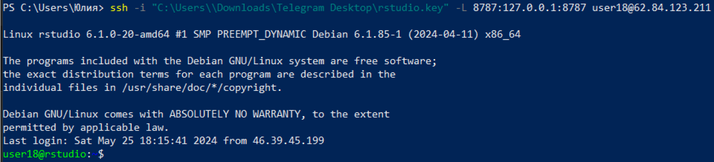

# Практическое задание №5
Журавлева Юлия БИСО-01-20

# Анализ данных сетевого трафика с использованием аналитической СУБД Clickhouse

## Цель работы

1.  Изучить возможности СУБД `Clickhouse` для обработки и анализ больших
    данных
2.  Получить навыки применения `Clickhouse` совместно с языком
    программирования R
3.  Получить навыки анализа метаинфомации о сетевом трафике
4.  Получить навыки применения облачных технологий хранения, подготовки
    и анализа данных: `Managed Service for ClickHouse`, `Rstudio Server`

## Исходные данные

1.  ОС Windows 10
2.  RStudio Server
3.  Yandex Object Storage
4.  СУБД ClickHouse

## Задание

Используя язык программирования R, библиотеку `ClickhouseHTTP` и
облачную `IDE Rstudio Server`, развернутую в `Yandex Cloud`, выполнить
задания и составить отчет.

## Ход работы

### 1. Настройка подключения к IDE Rstudio Server через ssh-туннель

-   Подключимся к RStudio Server аналогично предыдущей практической
    работе.

<!-- -->

    PS C:\Users\Юлия> ssh -i "C:\Users\\Downloads\Telegram Desktop\rstudio.key" -L 8787:127.0.0.1:8787 user18@62.84.123.211



### 2. Настройка рабочего пространства

-   Первым делом установим необходимые пакеты и библиотеки

``` r
library(dplyr)
```


    Attaching package: 'dplyr'

    The following objects are masked from 'package:stats':

        filter, lag

    The following objects are masked from 'package:base':

        intersect, setdiff, setequal, union

``` r
library(tidyverse)
```

    ── Attaching core tidyverse packages ──────────────────────── tidyverse 2.0.0 ──
    ✔ forcats   1.0.0     ✔ readr     2.1.5
    ✔ ggplot2   3.4.4     ✔ stringr   1.5.1
    ✔ lubridate 1.9.3     ✔ tibble    3.2.1
    ✔ purrr     1.0.2     ✔ tidyr     1.3.1

    ── Conflicts ────────────────────────────────────────── tidyverse_conflicts() ──
    ✖ dplyr::filter() masks stats::filter()
    ✖ dplyr::lag()    masks stats::lag()
    ℹ Use the conflicted package (<http://conflicted.r-lib.org/>) to force all conflicts to become errors

``` r
install.packages("ClickHouseHTTP")
```

    Installing package into '/home/user18/R/x86_64-pc-linux-gnu-library/4.3'
    (as 'lib' is unspecified)

``` r
library(ClickHouseHTTP)
library(DBI)
```

-   Данные хранятся в `СУБД Clickhouse`, поэтому нужно подключиться к
    хосту.

``` r
con_click <- dbConnect(
  ClickHouseHTTP::ClickHouseHTTP(),
  host="rc1d-sbdcf9jd6eaonra9.mdb.yandexcloud.net",
  port=8443,
  user="student24dwh",
  password="DiKhuiRIVVKdRt9XON",
  db="TMdata",
  https=TRUE,
  ssl_verifypeer=FALSE)
```

-   После подключения нужно занести в локальную переменную таблицу
    `data` из СУБД.

``` r
db <- dbReadTable(con_click, "data")
df <- dbGetQuery(con_click, "SELECT * FROM data")

df %>% head (10)
```

          timestamp           src          dst port bytes
    1  1.578326e+12   13.43.52.51 18.70.112.62   40 57354
    2  1.578326e+12 16.79.101.100  12.48.65.39   92 11895
    3  1.578326e+12 18.43.118.103  14.51.30.86   27   898
    4  1.578326e+12 15.71.108.118 14.50.119.33   57  7496
    5  1.578326e+12  14.33.30.103  15.24.31.23  115 20979
    6  1.578326e+12 18.121.115.31  13.56.39.74   92  8620
    7  1.578326e+12  16.108.75.29  14.34.34.69   65 46033
    8  1.578326e+12 12.46.104.126  16.25.76.33  123  1500
    9  1.578326e+12   12.43.98.93  18.85.31.68   79   979
    10 1.578326e+12  14.32.60.107 12.30.62.113   72  1036

-   Поле `timestamp` снова отображается некорректно, поэтому исправим
    его тип данных.

``` r
df_5 <- df %>% mutate(timestamp = as_datetime(timestamp / 1000, origin = "1970-01-01", tz = "UTC"))
df_5 %>% glimpse()
```

    Rows: 105,747,730
    Columns: 5
    $ timestamp <dttm> 2020-01-06 16:00:00, 2020-01-06 16:00:00, 2020-01-06 16:00:…
    $ src       <chr> "13.43.52.51", "16.79.101.100", "18.43.118.103", "15.71.108.…
    $ dst       <chr> "18.70.112.62", "12.48.65.39", "14.51.30.86", "14.50.119.33"…
    $ port      <int> 40, 92, 27, 57, 115, 92, 65, 123, 79, 72, 123, 123, 22, 118,…
    $ bytes     <int> 57354, 11895, 898, 7496, 20979, 8620, 46033, 1500, 979, 1036…

## Обработка данных

### Задание 1: Найдите утечку данных из Вашей сети

***Поставленная задача***

Важнейшие документы с результатами нашей исследовательской деятельности
в области создания вакцин скачиваются в виде больших заархивированных
дампов. Один из хостов в нашей сети используется для пересылки этой
информации – он пересылает гораздо больше информации на внешние ресурсы
в Интернете, чем остальные компьютеры нашей сети. Определите его
IP-адрес.

-   Для начала определим IP адреса внутренней сети, которые начинаются с
    12-14 октетов.

``` r
df_5_inside <- df_5 %>%
  filter(str_detect(src, "^1[2-4].")) %>%
  filter(!str_detect(dst, "^1[2-4]."))

df_5_inside %>% glimpse()
```

    Rows: 38,598,645
    Columns: 5
    $ timestamp <dttm> 2020-01-06 16:00:00, 2020-01-06 16:00:00, 2020-01-06 16:00:…
    $ src       <chr> "13.43.52.51", "14.33.30.103", "12.46.104.126", "12.43.98.93…
    $ dst       <chr> "18.70.112.62", "15.24.31.23", "16.25.76.33", "18.85.31.68",…
    $ port      <int> 40, 115, 123, 79, 123, 123, 22, 118, 94, 25, 105, 94, 25, 90…
    $ bytes     <int> 57354, 20979, 1500, 979, 1500, 1500, 1152, 5775, 1086, 42, 1…

-   Используя отфильтрованные данные внутреннего трафика, сгрупируем по
    IP-адресу источника и просуммируем его общее количество байтов.
    Выведем на экран итоговые значения источика с наибольшим количеством
    байтов.

``` r
sus_host5 <- df_5_inside %>% group_by(src) %>% 
  summarise(ins_sum5 = sum(bytes)) %>% arrange(desc(ins_sum5)) %>% collect()

sus_host5_1 <- sus_host5 %>% head(1)

cat("IP-адрес подозрительного хоста:", sus_host5_1$src, "\n", 
    "Сумма затраченного трафика (байт)", format(sus_host5_1$ins_sum5, scientific = FALSE))
```

    IP-адрес подозрительного хоста: 13.37.84.125 
     Сумма затраченного трафика (байт) 10625497574

### Задание 2: Надите утечку данных 2

***Поставленная задача***

Другой атакующий установил автоматическую задачу в системном
планировщике `cron` для экспорта содержимого внутренней wiki системы.
Эта система генерирует большое количество трафика в нерабочие часы,
больше чем остальные хосты. Определите IP этой системы. Известно, что ее
IP адрес отличается от нарушителя из предыдущей задачи.

### Задание 3: Надите утечку данных 3

***Поставленная задача***

Еще один нарушитель собирает содержимое электронной почты и отправляет в
Интернет используя порт, который обычно используется для другого типа
трафика. Атакующий пересылает большое количество информации используя
этот порт, которое нехарактерно для других хостов, использующих этот
номер порта. Определите IP этой системы. Известно, что ее IP адрес
отличается от нарушителей из предыдущих задач.

### Задание 4: Обнаружение канала управления

***Поставленная задача***

Зачастую в корпоротивных сетях находятся ранее зараженные системы,
компрометация которых осталась незамеченной. Такие системы генерируют
небольшое количество трафика для связи с панелью управления бот-сети, но
с одинаковыми параметрами – в данном случае с одинаковым номером порта.
Какой номер порта используется бот-панелью для управления ботами?

### Задание 5: Обнаружение P2P трафика

***Поставленная задача***

Иногда компрометация сети проявляется в нехарактерном трафике между
хостами в локальной сети, который свидетельствует о горизонтальном
перемещении (lateral movement). В нашей сети замечена система, которая
ретранслирует по локальной сети полученные от панели управления бот-сети
команды, создав таким образом внутреннюю пиринговую сеть. Какой
уникальный порт используется этой бот сетью для внутреннего общения
между собой?

### Задание 6: Чемпион малвари

***Поставленная задача***

Нашу сеть только что внесли в списки спам-ферм. Один из хостов сети
получает множество команд от панели C&C, ретранслируя их внутри сети. В
обычных условиях причин для такого активного взаимодействия внутри сети
у данного хоста нет. Определите IP такого хоста.

### Задание 7: Скрытая бот-сеть

***Поставленная задача***

В нашем трафике есть еще одна бот-сеть, которая использует очень большой
интервал подключения к панели управления. Хосты этой продвинутой
бот-сети не входят в уже обнаруженную нами бот-сеть. Какой порт
используется продвинутой бот-сетью для коммуникации?

### Задание 8: Внутренний сканнер

***Поставленная задача***

Одна из наших машин сканирует внутреннюю сеть. Что это за система?

## Оценка результата

текст

## Вывод

текст
